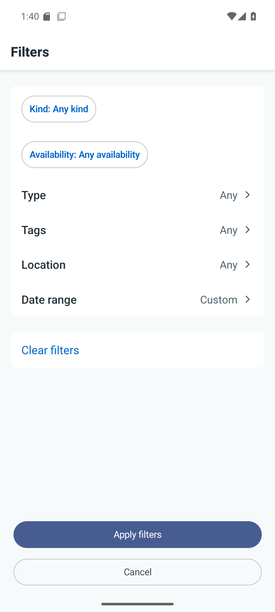
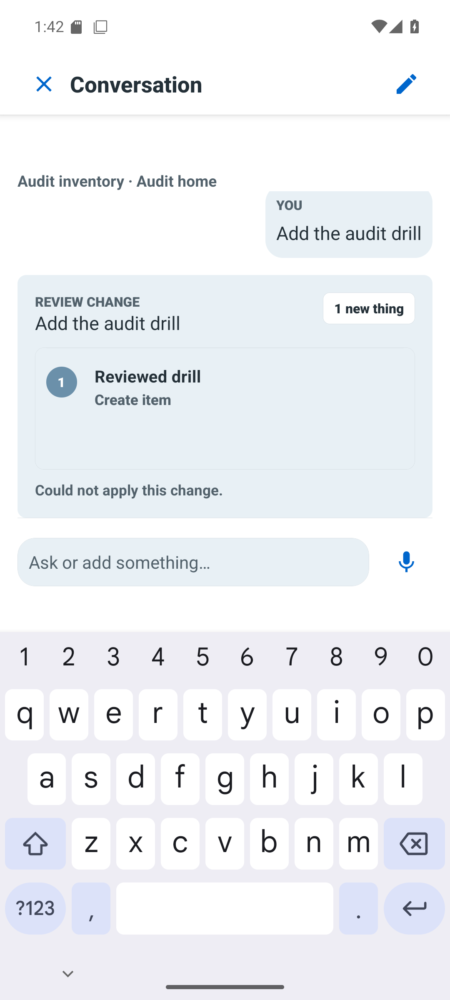

# Android native action descriptions

M248; normal-text native semantics finding. NativeSheetActions accepted but ignored
caller-provided descriptions. Expiration supplied “Apply expiration filters” but
only exposed “Apply filters”; voice review likewise lost its command context.
The assertion against `/tmp/android-expiration-footer-labels-before.xml` failed
before the corrected native implementation was installed.

The fix keeps Material buttons and their visible labels. A reviewed pnpm patch to
pinned Expo UI55.0.17 adds a native contentDescription modifier; the project
adapter maps names to it. Compose semantics augment rather than clear native role,
click and disabled properties, following
[Android's guidance](https://developer.android.com/develop/ui/compose/accessibility/semantics).
Android autolinking builds only expo-ui from source, because the bundled Maven
artifact lacks the patch. The first APK that reused that artifact correctly failed
acceptance and is not a successful result. iOS sources are unchanged.

## Native evidence

Accepted scope: API36 Pixel6 emulator, normal text/light, APK SHA256
`1bffd472c87354159eb4afd965adf9e533ac6b695f777c4c1e31301fb744c452`.
The log `/tmp/android-command-label-source-build.log` records actual
`:expo-ui:compileReleaseKotlin` and a successful build. It is a selectively updated
audit tree, not a complete current-HEAD release build.

Each expiration action has exactly one descriptive node in its native control,
an enabled/clickable ancestor and a button-role descendant; visible labels remain
Apply filters and Cancel. Activating Cancel returns to the audit index. AndroidX
[documents synthetic description and role children](https://android.googlesource.com/platform/frameworks/support/+/androidx-main/compose/ui/ui/src/androidMain/kotlin/androidx/compose/ui/platform/accessibility/android_a11y_implementation_notes.md),
so requiring all properties on one XML element was an invalid probe assumption.
No merge or semantics-clearing workaround was added.

Voice exposes Approve voice change and Cancel voice change. Clearing the proposed
name disables the clickable native approval owner; tapping it leaves the blank-name
validation intact. Typing Reviewed drill enables approval. Activating it reaches
the fixture's deliberate service failure and preserves that edited draft. This
verifies dispatch and disabled handling; it is not a real inventory mutation.

Retained XMLs on paul: `/tmp/android-expiration-footer-labels-{before,after}.xml`,
`/tmp/android-voice-footer-disabled.xml`, `/tmp/android-voice-footer-enabled.xml`.
Code critic found no blocker, including the native hierarchy interpretation.
TalkBack speech and broader device coverage remain unverified.

Frozen offline installation, TypeScript, structural checks and13 focused consumer
tests pass. The922-file mobile/client/patch/lock manifest matches paul's validation
tree. A stale image-viewer patch in that tree was replaced with the tracked version
before final installation; the committed lock change contains only the Expo patch.

Full mobile regression suite passes1,911 tests in299 files on the matched source
and installed patch set (`/tmp/android-command-label-full-tests.log`). This remains
separate from native and TalkBack acceptance.

## Screen-reader environment probe

TalkBack16.0.0.738667889 (versionCode60149353) is installed on the same API36
emulator. Enabling it produced a bound TalkBack service, touch exploration enabled,
and a visible green focus outline. Retained service dump on paul:
`/tmp/android-talkback-accessibility-state.txt`. This confirms availability only.

The emulator launches with `-no-audio`. Injected taps activated a command directly,
and injected Alt/Action navigation shortcuts did not demonstrate focus movement
or activation. Therefore this attempt does not establish a TalkBack interaction
or spoken-output pass. [Google documents the supported keyboard commands](https://support.google.com/accessibility/android/answer/6110948?hl=en),
but injection alone did not reproduce that keyboard path here. No application bug
is inferred from the inconclusive harness behavior. Enabled accessibility services
were restored to the prior empty setting and accessibility disabled after the probe.
A usable screen-reader input/audio path remains necessary for this acceptance axis.

Hardware-event follow-up: the AVD had `hw.keyboard = no`. Its idle emulator was
restarted with hardware-keyboard support enabled and the software keyboard kept
available (`show_ime_with_hard_keyboard=1`). The original AVD configuration is
retained on paul at `/tmp/android-audit-before-keyboard.ini`. The same installed
APK and data remain. Console EV_KEY/EV_SYN commands, including spaced modifier
press/release, still did not demonstrate reliable TalkBack next-item/activation.
A visible initial focus outline is not proof that those commands worked. TalkBack
was disabled again after inspection. Keyboard support remains enabled for future
input checks; audio remains disabled. No acceptance cell is promoted by this probe.
