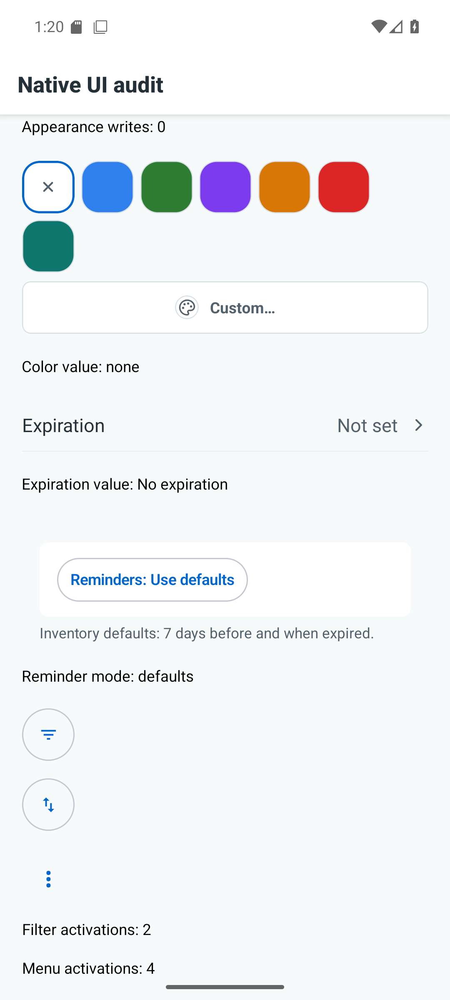
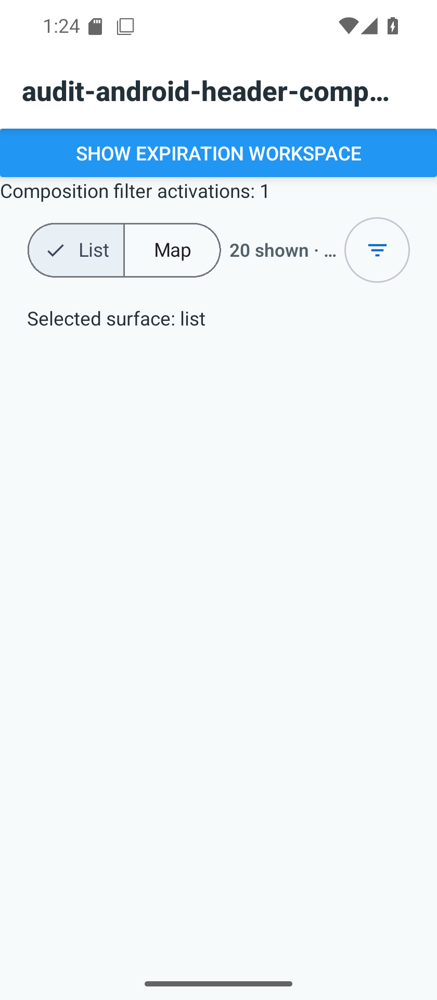
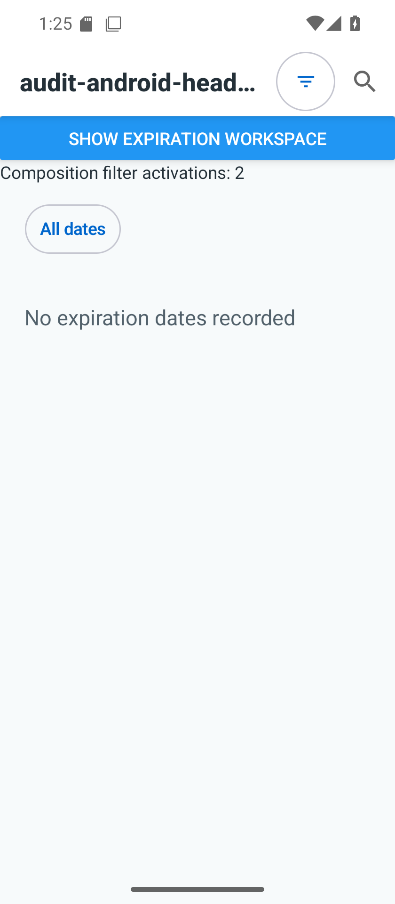

# Android compact control targets

M247: normal-text native measurement, Pixel 6 API36 emulator, 1080×2400,
420dpi. Real production adapters are exposed in the runner-only Android settings
fixture with local activation counters; no inventory data is changed.

Before: APK SHA256 `589358307b0f5c3c139ffbd8b2ada16d8e6b39b52aa279c59446aa48fa43ae6d`.
Refinement and overflow targets measured115×115px; sort115×116px, roughly44dp.
The filter center incremented its counter once; a tap four pixels beyond the right
edge did not. The React Native wrapper constrained the native control despite
Compose's usual minimum sizing. This is measured behavior, not an inference from
source literals. Android recommends [48dp touch targets](https://developer.android.com/guide/topics/ui/accessibility/apps).

The fix uses the existing minimumTouchTargetSize token for Android wrappers,
hosts and explicit Compose icon sizes. Label hosts reserve48dp too. iOS adapters
are unchanged. Browse's result row uses a minimum height and may expand; expiration
uses the native header slot. Shared menu consumers include choice pickers,
expiration status, asset overflow and history commands. No new navigation or
selection behavior is introduced.

Seven focused behavior tests, TypeScript, six fixture-installer tests and the
mobile structural check pass on paul. Code critic found no confirmed blocker.
These tests alone do not establish native target or header layout acceptance.

After: APK SHA256 `3a1b7301a292c27f16131f0f38d3758a8caeaf03c205de02f4e620b83a4d8ed8`.
All three wrappers measure126×126px, exactly48dp. Center and right-edge taps
activate each control; the filter counter is exactly2 and menu counter exactly4
following one center and one edge activation per control. The labeled reminder
menu remains fully visible; screenshot inspected for clipping and layout.

Measurements are retained on paul in `/tmp/android-compact-target-before.xml` and
`/tmp/android-compact-target-after.xml`; the probe script is
`/tmp/verify-compact-control-targets.py`. The APK is built from the retained
Android audit tree with the reviewed adapters and fixtures copied into it, not
claimed as a complete current-HEAD build. Actual Browse/expiration header
composition, narrow-width layouts, TalkBack, and iOS acceptance are separate
remaining checks; this isolated probe does not certify those surfaces.

## Consumer composition follow-up

APK `8d0f6e7f7d8014dff7de79a19212be46b24620f51694f1a72cf09df964198aa7`
mounts the production SearchHeader row and ExpirationWorkspaceScreen in a
runner-only route. At1080px and840px widths (411dp and320dp), both filter targets
measure126×126px and each tap delivers one command. Inspected captures show no
overlap between the filter and List/Map controls or native search button. The
Browse result summary truncates within its assigned remaining width; count and
controls stay visible. Expiration switches to its existing status menu at320dp.

The oversized audit-route title and blue workspace-selection button are fixture
scaffolding, not shipped UI. This closes the normal-text consumer target/layout
gap for these two compositions, not production route navigation, loading/data
states, TalkBack or broader platform acceptance. The six route-isolation tests,
TypeScript and structural checks pass remotely; critic found no blocker.
