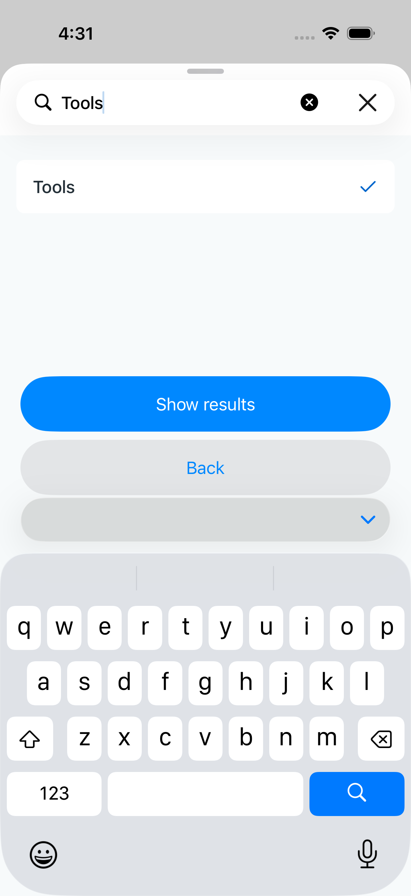
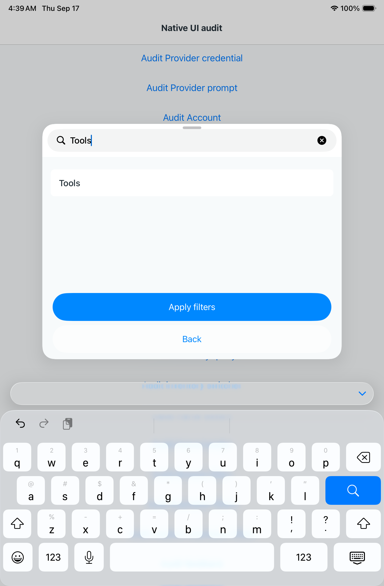

# Native boundary verification —35181153339

Source d8f4b4f0 includes the native keyboard-window adapter and reviewed pod lock.
Swift compilation succeeds. Phone job105073370182 passes8/9; iPad105073370467
passes9/9. Both Browse and Expiration exact-query, full keyboard-accessory
clearance and navigation/selection journeys pass. Last-tag application, in-place
availability, calendar dismissal, Sharing, Tags and Add draft also pass.

Reviewed phone Browse capture shows Tools selected and both commands fully above
the keyboard-dismiss accessory. The phone hierarchy places Apply/Show results at
Y367–421 and Back atY429–483; the accessory beginsY485. Previously Back endedY545.
The corrected geometry removes the62-point presentation mismatch. Reviewed iPad
Expiration capture shows the centered sheet and both commands above the keyboard;
Back endsY682.5 while its accessory beginsY739. Browse iPad and Expiration phone
hierarchies show matching clearance; their captures are retained separately.

This accepts the reported M249 normal-text portrait overlap in the candidate.
Rotation, Stage Manager/window resizing, dark mode and physical-device variation
remain broader adaptation verification; these sampled checks do not certify every
matrix axis. TestFlight113.1 still contains the old behavior.

The sole phone failure is the existing ordinary color-picker direct-opening
assertion. Keep it tracked and inspect its retained state rather than treating this
run as entirely green. M251 photo-status rendering also still needs capture review.
No new release is claimed.

Artifacts: phone10480533028 and iPad10480753114, retained on paul as
/tmp/native351811-phone.zip and /tmp/native351811-ipad.zip. Logs are
/tmp/boundary-native-JOBID.log. A sleeping shell collector waited for terminal
results without repeated model polling.
