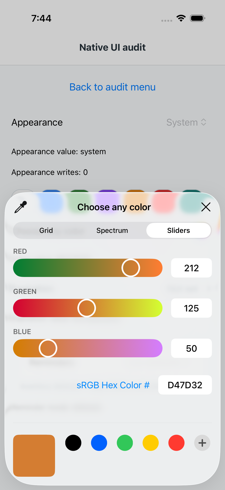
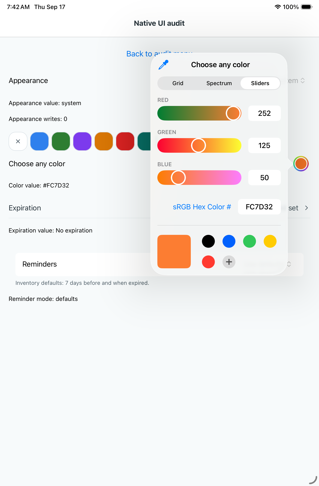

# Native RGB rounding: candidate 5e192167

The installed @expo/ui55.0.17 source truncates normalized channels. macOS
CI35188426003/job105095410817 compiled its actual conversion expression and
failed: expected1, got0 for0.0039215686274509795. The one-line backport from
Expo commit dc32c26bd016c4187ada75d189c9d81f78a1060a adds nearest-integer rounding.

CI35188783384 succeeds. Its iOS dependency job105096587155 passes all9,472
installed-expression numeric checks, pod resolution and lock consistency.
The pnpm diff changes only the Expo patch identity; two ExpoUI pod paths follow
that identity. Existing Android patch additions/deletions are identical. Scoped
presentation tests, TypeScript and structural checks pass on paul. Critic found
no blocker. This accepts numeric conversion (M252), not complete UIKit editing.

Native35188788934 builds the candidate on both devices. Four focused cases run:

| Case | Phone105096535226 | iPad105096535411 |
| --- | --- | --- |
| Ordinary opening / close / preset / clear | Pass | App launch timed out before test body |
| Delivered touch region | Fails opening at center probe0 | All probes pass |
| Single accessible name | Pass | Pass |
| Target opens system picker | Pass | Pass |

The phone's center failure preserves M51; other passing cases do not erase it.
The iPad launch timeout does not demonstrate a color-control bug. These journeys
do not edit individual native RGB channels, so integrated channel retention
remains unverified despite the compiled numeric proof. No fresh captures were
visually reviewed for this run. Tests/logs are evidence only for their assertions.
The code is in draft PR157 and is not included in TestFlight114.1.

Shared consumers are Add tag creation, item Edit tag creation and Settings tag
customization through TagColorPicker/FullSpectrumTagColorPicker. The numeric fix
applies to their common iOS dependency; Android behavior is unchanged.

Sleeping shell observers waited for terminal jobs without restarting or polling
through model turns. Logs: /tmp/color-contract-red.log,
/tmp/color-contract-green.log and /tmp/color-rounding-native-JOBID.log.
Removed the inactive, regenerable /tmp/stuffstash-expiration-go-cache on paul,
recovering2.8GB; native evidence and source checkouts were retained.

## Integrated RGB acceptance —35191010731

The new native test passes on phone105103362498 and iPad105103362541. The
artifact revision is PR merge620c9d0648ff496303cd6d238627996a8ee1a9b6 for
branch headf4c00a408c78641d208187dd622414e050588006. It changes only the labeled
Red slider three times, closing and reopening between changes. Starting from
#2E7D32, phone parent values are#687D32,#257D32,#D47D32; iPad values are
#817D32,#357D32,#FD7D32. The six retained parent hierarchies confirm unchanged
Green125/Blue50. Reviewed final slider captures on both devices also show125/50.
Red can continue settling between capture and dismissal; no exact Red target is
claimed. Each edit must change Red and preserve the other bytes.

This closes M252's numeric and integrated controlled-edit acceptance in the
candidate. The fix remains unreleased. Ordinary opening fails separately on
both devices in this same run, so M51 is not closed by the RGB test's passes.
Full source CI is green; the comprehensive native suite still has other findings.
