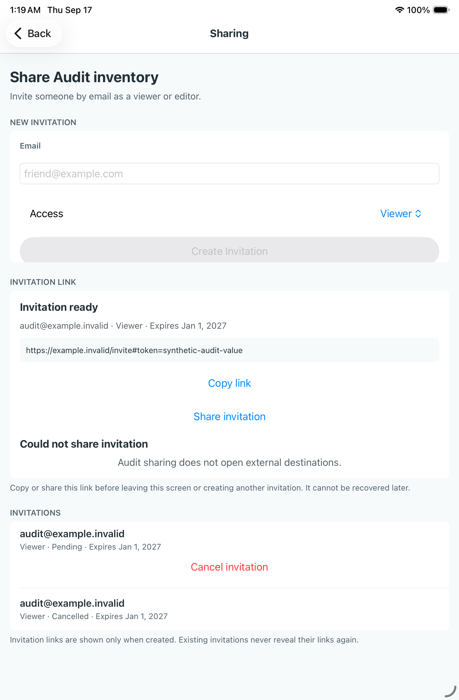
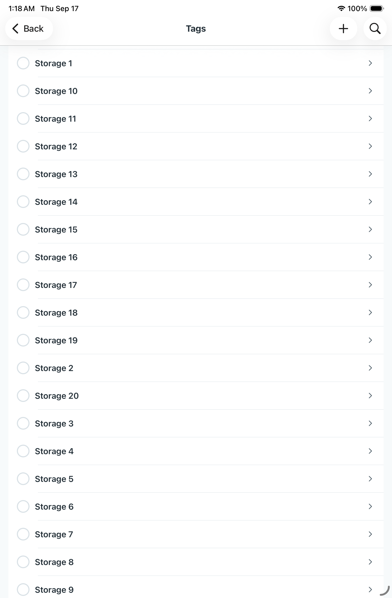
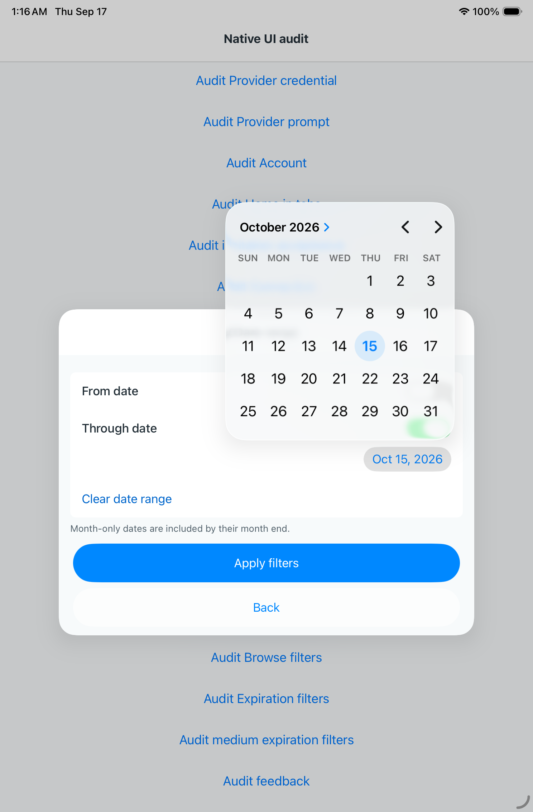

# Release corrections — native run35165286470

Source966158e6 includes production cutoff223d6d0a (iOS invitation email),
production Tags fixture title and nine-case release-corrections selection.
Phone job105035677143 passes7/9; iPad job105035677297 passes8/9.
These supplement the frozen release matrix and do not replace it.

Sharing, Tags native Add/Search, Add draft recovery and ordinary color activation
pass on both devices by XCTest assertions. The iPad captures below are reviewed.
Sharing retains the complete audit@example.invalid address in the created
invitation, resets the field and preserves link/actions after a controlled external
sharing rejection. This fake intentionally opens no external destination. Tags
shows the production title with separate native Add and Search controls.

Phone Browse and Expiration tag searches fail their exact-query assertions: the
field contains T rather than Tools. This does not clear previous phone footer
overlap; the complete query and keyboard/action geometry remain batch checks.
Both last-tag selection and in-place availability pass.

The iPad calendar test fails before tapping: its target calculation excludes all
blank navigation-bar points because app-wide button frames include the fixture
launcher behind the modal. The retained capture shows the calendar and date
sheet still open. Geometry records navigation(82,441.5,580,54), calendar
(314.5,282,320,332.5), and background row(20,438,704,37.5) covering every candidate.
[Retained geometry](ipad-calendar-geometry-351652.txt).
The correction scopes command exclusions to that navigation bar; candidates stay
inside the bar and outside the calendar/title. All dismissal/Apply/Back assertions
remain. Native rerun is required; source checks do not clear this case.

Logs: /tmp/native351652-corrections-phone.log and
/tmp/native351652-corrections-ipad.log. iPad artifact10476625513 remains on paul
at /tmp/native351652-corrections-ipad.zip. Phone captures are not yet reviewed.
