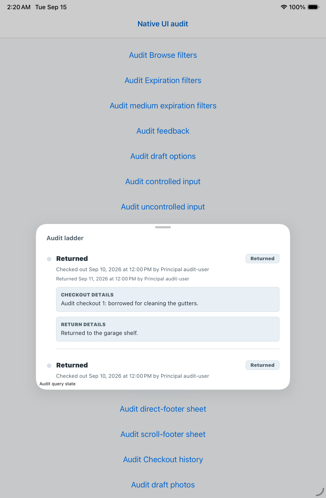
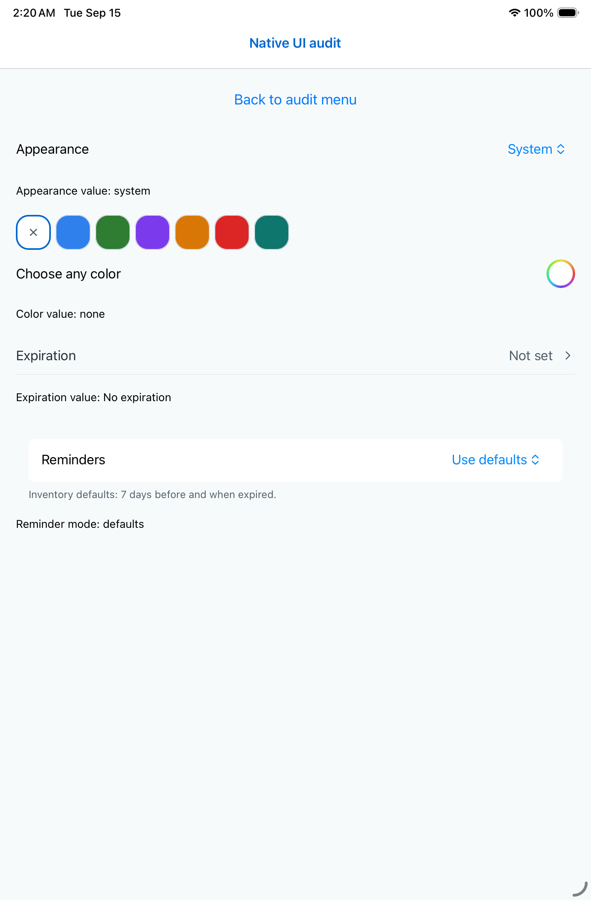
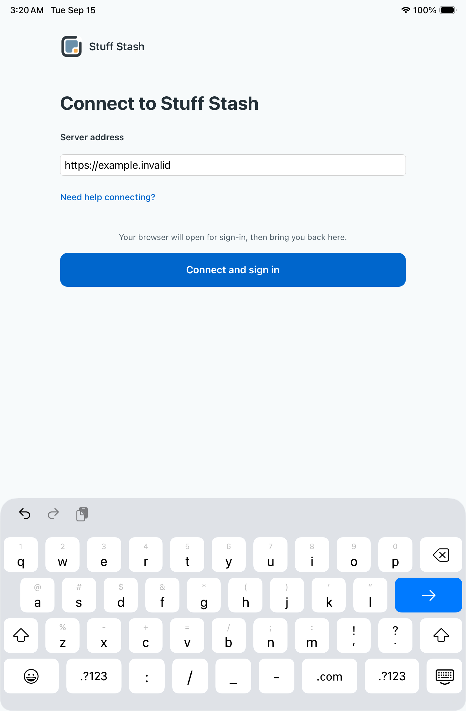
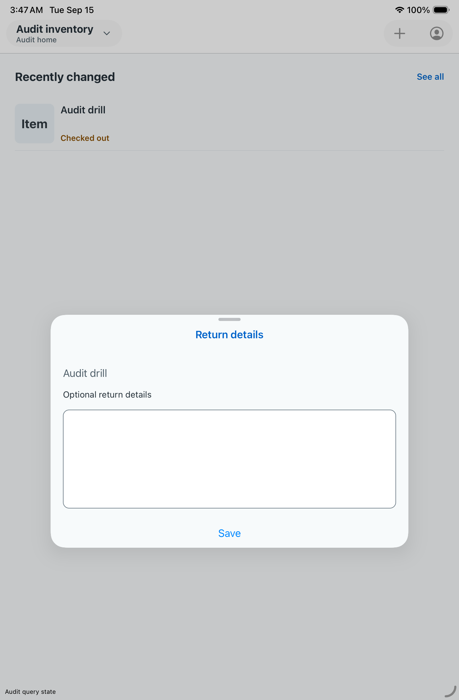
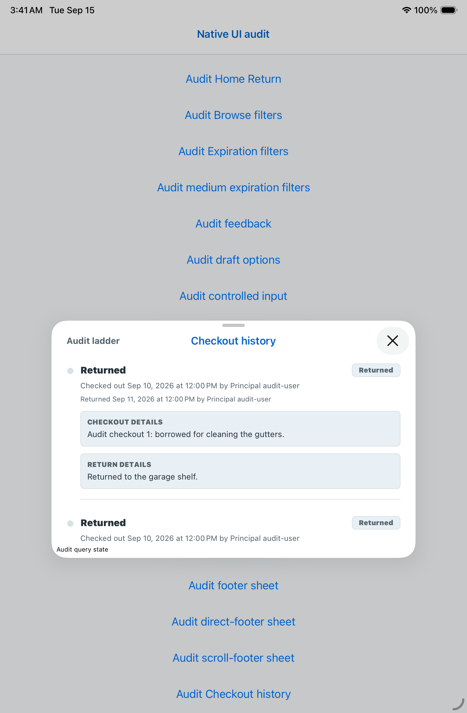
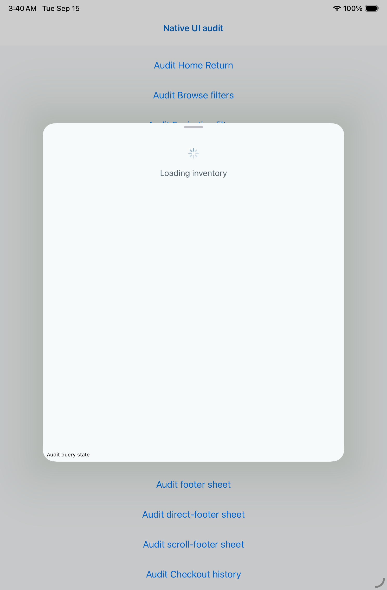
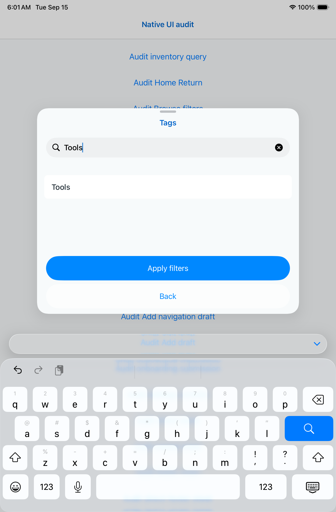
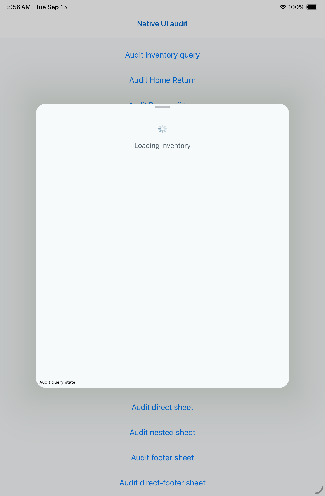

# Native simulator evidence

Run [34882515267](https://github.com/elsell/stuffstash/actions/runs/34882515267),
source a3fefb9761f3677d88b985186b13b8b378c984a0 (PR merge artifact records
merge revision e45599fc022bf89ce42367c25332f2b563807ba5).
Release simulator build on macOS 26 / Xcode 26.6; iPhone 17 and iPad mini (A17 Pro).
Both applications built and launched. Both tests failed the keyboard-dismissal
assertion. This is not a successful smoke run or an authenticated-app review.

The test opened and closed connection help successfully on both devices. Inspected
iPhone screenshots show the entry, help content, and sign-in action above the
visible keyboard without clipping at the default text size and light appearance.
This does not establish large-text, dark-mode, landscape, VoiceOver, or iPad layout quality.

- [Entry screenshot](evidence/onboarding-entry.png)
- [Help screenshot](evidence/onboarding-help.png)
- [Failed keyboard state](evidence/onboarding-failed-keyboard.png)

The initial dismissal check swiped upward over the whole application. iOS interactive
dismissal follows a downward drag from scroll content toward the keyboard; the
procedure is corrected in 23b17cc4 and awaits a new native result.

The entered address appears as `h.invalid` after `typeText("https://example.invalid")`.
M14 tracks this separately. The revised test asserts the full value; a failure
there leaves dismissal untested because XCTest stops after the first failure.
Do not infer a React input defect until reproduced against simulator typing behavior.

PNG files are unmodified screenshot payloads extracted from the XCTest result bundle.
Future runs export named attachments with xcresulttool directly on the macOS runner.

## Filter rerun 34897215957

Revision `254f5820c2c9c3c23ad4d2d8ca7b84f60a73c617` (PR merge of
`b0d7ce0c`). iPhone17 and iPad mini(A17 Pro), default text, light appearance.

- Browse visible labels, native availability selection, and Apply/Cancel passed
  on both devices. Inspected phone screenshot:
  [visible labels](evidence/browse-visible-labels-34897215957.png).
- Persistent actionable feedback passed on both devices.
- Expiration date-page and search-keyboard scenarios passed on iPad. Inspected
  [keyboard screenshot](evidence/expiration-ipad-keyboard-34897215957.png)
  shows both actions above the keyboard.
- Both expiration scenarios fail on iPhone before reaching their task: the
  body is absent. [Blank sheet](evidence/expiration-phone-blank-34897215957.png)
  and native hierarchy confirm the footer is present but ScrollView is absent.
  Removing KeyboardAvoidingView did not resolve M19; the prior causal hypothesis
  is rejected. A separate medium-detent diagnostic retains the failing full-height
  production fixture to avoid masking the issue.
- Onboarding full-string entry fails on both devices (`hmple.invalid` phone,
  `hs://example.invalid` tablet). Gesture dismissal is not reached in this run.
  Controlled/uncontrolled fixture comparison is pending; no production input
  workaround is justified yet.

These scenarios establish only their named interactions. They do not establish
whole-screen accessibility, larger text, dark mode, Android or physical-device behavior.

### Diagnostic run 34903318947

[Run](https://github.com/elsell/stuffstash/actions/runs/34903318947), source
`eeeefd5b`, completed with failures. All eight iPad fixture scenarios passed.
On iPhone, Browse filter selection/apply, persistent feedback, draft enum removal,
medium-detent expiration body and uncontrolled URL entry passed. The full-height
expiration body remained absent in both scenarios; controlled URL entry lost
characters (`hs://example.invalid`). This isolates a detent-sensitive sheet failure
and an input synchronization suspect; it does not prove a framework root cause.
The same controlled-input fixture passed on iPad, so the input problem is not
universal across devices/runs.

Production onboarding URL entry still failed on both devices; keyboard dismissal
was consequently not reached. The iPad landscape adaptation scenario passed.
No additional whole-surface or accessibility claims follow from these scenarios.

Inspected the [iPhone medium-detent screenshot](evidence/expiration-phone-medium-34903318947.png):
all six filter rows and the Apply/Cancel footer are visible. This is diagnostic
presentation evidence, not evidence of expansion or date/keyboard completion.

Remote source regression verification after native settings/input candidates:
1,353 tests in 242 files passed on paul, followed by TypeScript and the mobile
structural check. This includes mounted header tests replacing legacy module
mocks; code critic found no meaningful behavioral coverage lost. Native runtime
results remain separate from this source verification.

### Resizable-sheet run 34905451368

[Run](https://github.com/elsell/stuffstash/actions/runs/34905451368), source
`8bada3d9`, failed. Initial medium-detent content is visible, but expansion
removes the body on both devices. The iPhone expansion assertion confirms actual
upward movement before content reachability fails. The iPhone search keyboard
also removes the body and footer; iPad search action reachability passes.
See the [expanded sheet](evidence/expiration-expanded-empty-34905451368.png).
This rejects the detent configuration as a sufficient fix for M19.

The [calendar screenshot](evidence/expiration-calendar-open-34905451368.png)
shows the popover still open: the test's navigation-bar tap selected a date
inside it. That action-reachability failure does not independently establish
a product defect. Correct the dismissal target before evaluating it again.

Controlled and uncontrolled phone URL fixtures both lost initial characters;
iPad uncontrolled passed while controlled failed. Production onboarding also
lost characters on both devices. This weakens the earlier synchronization
hypothesis and does not establish a cause. Tests currently begin typing before
explicitly verifying keyboard readiness. Full-string assertions remain required.

Browse menu/apply, feedback retention, and draft-option removal passed on both
devices. These results certify those scenarios only, not whole surfaces.

Hierarchy inspection of run34905451368 distinguishes the expanded failure from
ordinary scrolling: the initial sheet contains its ScrollView and Choose tags
button, while the expanded sheet subtree no longer exposes a ScrollView or its
rows. The footer still has a valid frame. This does not establish why the view
vanished. The pinned screens implementation coerces form-sheet scroll frames by
searching direct children (or its own safe-area wrapper); its footer option is
explicitly Android-only. A nested-body versus direct-scroll diagnostic is needed
before adopting another production layout workaround.

Run34906713382: the iPhone onboarding job104186247263 terminated with an Xcode
application-launch timeout before its keyboard scenario could execute. This is
an infrastructure/launch failure, not confirmation or rejection of M14. The run's
other jobs were still active when this job log was inspected.

### Run 34906713382 completed

[Run](https://github.com/elsell/stuffstash/actions/runs/34906713382), source
73ff5bad, failed. Appearance menu selection, compact expiration date entry,
Browse menu/apply, draft option removal and feedback passed on both devices.
The full expiration expansion failure persists on both, with phone keyboard
footer failure and the already identified calendar dismissal test mistake.

The [color picker screenshot](evidence/color-picker-open-34906713382.png) proves
it opened directly. The test incorrectly requested `Close`; the native hierarchy
labels it `close`. Close/clear checks still need completion after correction.

Uncontrolled input preserved the full URL on both devices this run; controlled
phone input still lost initial characters. The onboarding submission fixture
passed on iPad. On phone it preserved the full displayed URL, but its submitted
value remained `none`. The [screenshot](evidence/onboarding-keyboard-action-34906713382.png)
shows most of Connect behind the keyboard despite XCTest reporting hittability.
The command test will explicitly dismiss the keyboard; keyboard layout remains
unresolved. Production phone onboarding failed at app launch; iPad production
stopped at the help-collapse assertion before typing, so neither verifies M14.

Add failed before Asset name appeared on both devices. Phone log checks for an
unexpected app termination and lacks the usual final screenshot/hierarchy. The
recording ends around Add activation. This needs crash diagnostics; it does not
prove a form layout cause. The queued keyboard-readiness run34907820613 has now
started. Later source fixes and the isolated sheet diagnostic were pushed only
after it started, preserving that run.

### Run 34907820613: partial results and keyboard procedure correction

[Run](https://github.com/elsell/stuffstash/actions/runs/34907820613), source
a01407dc (merge cac89c8f), still had its phone fixture job running when reviewed.
Both onboarding jobs failed before typing at the new keyboard-readiness condition.
The inspected phone hierarchy exposes a zero-size `Padding-Left` Key before real
letter keys. The [screenshot](evidence/onboarding-keyboard-ready-34907820613.png)
shows a visible keyboard and focused field. Therefore the first-key hittability
assumption was invalid. Both test helpers now require any hittable key; exact
full displayed/submitted text assertions remain. Critic found no blocker;
compilation and native execution of this correction remain pending.

The completed iPad fixture job passed appearance menu selection, Browse
availability/apply, draft option removal, compact expiration dates, actionable
feedback, and the corrected date-page calendar dismissal/action scenario.
Expiration expansion still lost its body. Add still failed before Asset name
appeared. Color still hit the previously identified uppercase Close selector
mistake (the correction was not in this run). Keyboard scenarios stopped at the
readiness test mistake and provide no new evidence about typing preservation or
keyboard/footer layout. Production iPad landscape passed.

Run34907820613 is now complete (failed). Phone fixture results match the iPad
passes/failures above, including date-page dismissal/action reachability. The
phone Add failure explicitly reports loss of the application connection before
Asset name appears. This does not establish whether the root cause is JS, native
code, or fixture composition; crash collection is queued with later source.

Run34909419413 (4020f012) started before the next push, preserving the isolated
sheet-layout diagnostic. Run34911480135 (6d79ad49) is pending with the corrected
keyboard/color procedures, crash diagnostics, and later source fixes. Neither
pending/run-start status is acceptance evidence. No TestFlight release yet.

## Sheet structure comparison — run 34909419413

Source `4020f012`; tested merge `214adece86a450b4c028a0b5d0855b9dab164f24`.
Both devices completed the fixture suite. The direct-scroll-view diagnostic passed
on iPhone and iPad. On iPhone, both nested-wrapper variants failed because the
Tags row was absent; the retained screenshots show a blank body, with only bottom
commands in the footer variant. On iPad, all three isolated layouts passed.
The production expiration sheet still failed after expansion on both devices.
This narrows the phone layout failure to container integration; it does not yet
establish a production fix or explain the iPad expansion failure.

- [Direct scroll view, visible rows](evidence/sheet-direct-phone-34909419413.png)
- [Wrapper plus footer, blank body](evidence/sheet-footer-phone-34909419413.png)
- [Wrapper only, blank body](evidence/sheet-nested-phone-34909419413.png)

Appearance, Browse availability, draft option removal, compact expiration dates,
date-page actions and persistent feedback passed on both devices again. Add
failed before the name field appeared. Color-picker and keyboard tests still used
the older selectors/readiness procedure; their replacements are in the next run.
iPad production onboarding landscape passed. These are sampled runtime results,
not whole-surface or whole-app acceptance.

## Interim release checkpoint

The user requested delivery of the current fixes before continuing the audit.
PR 127 merged as `34ae627f3caedd41a22e8b52456e79c8e5154035` after CI
34912595716 passed. Remote source validation passed 1,374 mobile tests, TypeScript
and structural checks. Release [34913014534](https://github.com/elsell/stuffstash/actions/runs/34913014534) completed successfully.
Signed **0.24.11 (99.1)** uploaded at 2026-09-15 00:50:40 UTC; Apple processing
and the exact-build TestFlight changelog were verified at 00:53:08 UTC. The audit and unresolved native findings
remain active. Subsequent changes belong to the continuation branch.

## Follow-up native evidence — run 34912595714, iPad fixture

Source `231afec0`, tested merge `c4b3f395443e6819679367fcb33a42e11a7769e5`.
iPad controlled/uncontrolled address entry, complete onboarding submission,
expiration search with keyboard and reminder-mode menu scenarios passed with the
corrected procedures. Production onboarding after help expansion/collapse still
retained only `h`, so M14 remains open. The actual filter expansion failure remains.

The named draft-photo state passed XCTest accessibility checks for hit regions,
sufficient descriptions, traits, contrast, Dynamic Type and clipping. The inspected
[screenshot](evidence/draft-photo-ipad-34912595714.png) shows the four photos and
48-point Remove commands. This is partial evidence for this state only. The
interaction case stopped at its rail selector: the native hierarchy attaches the
testID to an Other wrapper containing a ScrollView, not directly to the ScrollView.
The next procedure targets that observed container; removal/read-only behavior
has not yet passed natively.

Add still fails before the name field. Its retained crash includes
RCTExceptionsManager/reportFatal and a native segmentation fault during cleanup,
without a useful JS message. A runner-only React error boundary is added to expose
render failures in the next run; it does not catch native or asynchronous crashes.
The color picker now opens, but its close button was not hittable in the test.
These unresolved states remain in the audit, independently of interim delivery.

### Same run, completed phone fixtures

Phone color-picker open/close and Clear, full onboarding address submission,
reminder-mode selection, and the uncontrolled input comparison passed. Controlled
input retained `h://example.invalid`, and expiration search could not reach its
post-keyboard action. The direct full-sheet diagnostic passed; wrapped variants
and actual sheet expansion still failed. Draft-photo accessibility checks passed,
but the old rail selector stopped interaction testing as on iPad. These results
narrow the failure conditions rather than proving all text entry or sheets work.

The inspected iPad color screenshot shows a system popover without a visible Close
button. Its hierarchy supplies `PopoverDismissRegion`; the next procedure uses an
outside tap there and waits for the picker to disappear. The phone retains its
Close action. Two additional isolated sheet layouts compare direct-scroll sibling
and in-content footers. Their geometry is recorded for inspection against the
sheet bounds; a screen-relative bottom assertion was rejected in code review.
Remote type and structural checks pass. Production filters remain unchanged until
native evidence supports the replacement structure.

### Run34915099794: completed onboarding jobs, fixtures still running

Source527287c8. The completed phone job104210917195 and iPad job104210916927
both fail the production onboarding complete-address assertion at line72:
`h://example.invalid` instead of `https://example.invalid`. The iPad landscape
scenario passes. M14 remains unresolved; neither native control availability nor
source checks prove typing is reliable. Fixture jobs were still running when
these completed job logs were inspected; their outcomes are not inferred here.

The continuation History fixes (9a7c086f,7e84dc8d) are not in this run or interim
TestFlight0.24.11. Their new checkout-history fixture uses the production screen,
queries and sheet options with synthetic repositories. It checks phone detent
expansion, body and older-page reachability, and native Close. iPad presentation
is exercised but its expansion is observational because iPad detents differ.
No native result is claimed for this scenario yet.

### Run34915099794: completed iPad fixtures

The iPad fixture job104210917159 finishes with 13 of19 scenarios passing.
Source527287c8, test merge4567b6075856a79fe1fa9bcc2037c57c3e142604.
Its artifacts establish two useful distinctions:

- **Add render failure (M46):** the new error boundary reports `Maximum update
  depth exceeded`, with `Screen`, `StackScreen` and `ScopedAddAssetScreen` in the
  component stack. This is a render/update loop, not merely an undiscovered text
  field. The [retained screenshot](evidence/add-render-error-ipad-34915099794.png)
  and hierarchy32D5AC17-DE1F-4E29-AA3E-532D6DF97537.txt expose the message.
  Source inspection finds Add creating new header-option callbacks each render;
  pinned Expo Router Screen calls navigation.setOptions whenever options identity
  changes. This is the next reproduction target, not yet proof that stabilizing
  options alone fixes the native crash.
- **Photo read-only timing:** both intended removals and Add callback succeed.
  The immediate Add-absence assertion fails, but the [retained final screenshot](evidence/draft-photo-readonly-ipad-34915099794.png)
  and hierarchy93AE14BB-27CF-4DE9-A3E9-E4B6BF00ADE5.txt show exactly two retained
  images and neither Add nor Remove. The test now waits for this asynchronous
  transition, retaining all final assertions. The complete scenario still needs
  a passing native rerun.

Controlled input and full onboarding submission lose characters in this run;
uncontrolled input passes. Their differences from the preceding run do not
establish reliable input. Appearance, Browse choice, compact expiration, date
page, expiration keyboard actions, reminder menu, draft-option removal, photo
accessibility and isolated direct/nested/footer layouts pass. Actual expiration
sheet expansion still fails. The old iPad color Close procedure still fails;
its popover correction is in the next queued candidate, not this source.
The phone fixture job was still live when this iPad evidence was recorded.

### Continuation run34917318548: phone onboarding

Source50ebdabb, phone job104219118844 completed failure on September15 at01:48UTC.
The complete-address assertion expected `https://example.invalid` but read
`hexample.invalid` after the help/keyboard sequence. Landscape is explicitly
skipped on the phone. This repeats M14; it is not evidence for a fixed production
input path. The iPad and fixture jobs are still live, including the new native
SwiftUI input comparison and Add header-loop candidate. Their outcomes must be
inspected independently when terminal. Job log saved as
`/tmp/native349173-onboarding-phone.log` on the audit host.

Run34917318548 iPad onboarding job104219118994 also completed failure: expected
`https://example.invalid`, actual `h://example.invalid`. Its landscape adaptation
scenario passed. This preserves the distinction between layout and input behavior;
M14 remains unresolved. Log `/tmp/native349173-onboarding-ipad.log`.

### Second interim release delivered

[Release34917914704](https://github.com/elsell/stuffstash/actions/runs/34917914704)
completed successfully. Version0.24.12 build100.1 uploaded at01:55:59UTC and its
exact-build TestFlight changelog was verified at01:58:20UTC after Apple processing.
Release source is PR129 merge3cc21557. Logs are
`/tmp/mobile-audit-02412-upload.log` and `/tmp/mobile-audit-02412-notes.log`.
This delivery fulfills the interim release request; it does not close native audit
findings. PR131's shared-header and Home follow-up changes are outside build100.1.

### Run34917318548 completed: decisive comparisons and remaining readiness failures

Source50ebdabb, test merge2381cf86f567d7da97ea6a34bd528107d12f2cb4.
Phone fixtures passed15/23; iPad passed19/23. Logs are
`/tmp/native349173-fixtures-phone.log` and `/tmp/native349173-fixtures-ipad.log`.
Downloaded iPad artifacts: `/tmp/native349173-fixtures-ipad`.

- SwiftUI system URL entry passes on both devices, including native displayed and
  observed callback values. Controlled React Native entry fails on both; uncontrolled
  entry passes this run but has failed earlier. This narrows the comparison without
  proving production onboarding fixed.
- Draft photo removal/read-only preview and photo accessibility pass on both.
  Corrected iPad color popover procedure also passes on both.
- Direct-root sheet, direct-root plus sibling footer, and scroll-contained footer
  pass on both. Wrapped nested/footer bodies still fail on phone. Actual expiration
  expansion fails on both; keyboard reachability fails on phone and passes on iPad.
- Add does not reach its name field. The inspected iPad screenshot now shows a
  stable native Add header and [Loading inventory](evidence/add-loading-ipad-34917318548.png),
  not the earlier Maximum update depth exception. The complete Add scenario remains
  failed; header stability alone is not acceptance.
- Checkout History does not reach its title/content assertions. The inspected
  [iPad screenshot](evidence/checkout-history-loading-ipad-34917318548.png) shows
  Loading checkout history and the fallback Asset title. No expansion/pagination
  success can be claimed because readiness failed first.

M50 tracks the unresolved Add/History fixture readiness. Runner-only query-state
inspection will distinguish cache/fetch/subscription state without bypassing the
production query path. This is not yet proof that production network requests hang.

## Run34919776387 — completed native checkpoint

Candidate709abc1f (runner merge5d5fd318) predates the M19 direct-root change, M14
system onboarding field and M47 return sheet. Phone fixtures passed15/23; iPad
fixtures passed17/23. Both devices still failed Add readiness, History header
readiness, controlled URL entry, expiration expansion and color-row opening.
Phone additionally failed expiration keyboard actions and both wrapped-layout
diagnostics. iPad additionally failed full onboarding command submission.

Both devices passed system and uncontrolled input comparisons, direct-root and
direct-root/sibling-footer diagnostics, scroll-footer layout, menus, compact
expiration selection, date-page footer, draft photo actions/accessibility and
actionable feedback. These are scenario passes, not whole-surface certification.

Production phone onboarding lost characters (`h://example.invalid`); portrait
keyboard coverage failed and landscape was correctly skipped. iPad portrait failed
keyboard existence after typing; its supported landscape scenario passed.

Inspected iPad History screenshot411673A8 shows loaded records but no navigation
header. Thus its title-readiness failure cannot be reduced to query loading. Add
screenshotABB3BE71 still shows Loading inventory. The safe query diagnostic exists
but debugDescription truncates its value; only online=true is readable. Explicit
AX-value attachments are needed before interpreting focus/query/fetch states.

Color screenshot87D1734B shows the unchanged parent after tapping the native row.
Its hierarchy0712C39C exposes a704×36point color-picker button spanning label and
trailing well. A new independent well-target experiment will distinguish this
from failure of the picker itself; the original row-activation assertion remains.

## Interim release 0.24.13 (101.1)

Release34920497945 completed successfully from merged PR131 (8b1fe7b8).
Signed upload job104229066004 reported success at02:42:13UTC September15.
Job104232577094 verified Apple processing and the exact-build changelog at02:44:35UTC.
This delivers the requested current-fixes milestone; it excludes PR132's subsequent
onboarding, native Home return sheet and History header candidates. The full audit
remains active, with native failures and unreviewed cells retained.

## Run34920888328 — onboarding jobs available before fixture completion

Candidate890cf904 includes the iOS system-address field and native responder
keyboard dismissal, but predates the Home return sheet. iPhone onboarding job
104228556273 passed the full portrait help/input/dismissal scenario and correctly
skipped unsupported phone landscape. This is a named scenario pass, not full
onboarding or iPad certification.

iPad job104228556347 failed launching the app: Xcode timed out during launch for
portrait and acquiring a background assertion for landscape. These failures did
not reach the UI assertions and provide no verdict on address preservation. Keep
iPad verification pending and use the already queued newer candidate rather than
restarting running fixture jobs. Full fixture results remain pending at this entry.

## Run34920888328 — complete checkpoint

Source890cf904, runner merge4b934a69: phone fixtures18/25 pass, iPad22/25 pass.
The production address-submission fixture and keyboard Go submission pass on
both devices. Production phone onboarding also passes; the separate production
iPad launch failed before UI assertions. These results establish the named
address-entry scenarios, not all onboarding states.

Expiration sheet expansion passes on both devices with the direct-root candidate.
Phone search keyboard reachability still fails: the retained screenshot shows
Tags with Tools entered and the keyboard visible, with no bottom commit/cancel
controls visible. The same scenario passes on iPad. The phone overview accessibility
audit reports potential clipping at larger Dynamic Type; its element attachment
identifies Availability. Default-size screenshots cannot establish large-text fit.
iPad overview accessibility passes. Phone nested/footer diagnostic variants fail;
direct/direct-footer/scroll-footer variants pass.

Add readiness, History header and the old controlled-input comparison fail on both
devices. This source predates the initial History header fix and Home return-sheet
implementation. Color-row activation passes on both devices in this run; prior
intermittent failure remains open. Logs are retained at
`/tmp/native349208-fixtures-phone.log` and `/tmp/native349208-fixtures-ipad.log`.

## Next interim release requested

PR132 merged as308764060802bcfa5c9b34f99aa2c0b80c381c86 after required checks passed.
[Release34923402256](https://github.com/elsell/stuffstash/actions/runs/34923402256)
is running. It includes the onboarding address, Home return details, initial History
header and field-editor command fixes. Upload, Apple processing and exact-build
changelog are not yet verified. The audit continues on a separate branch.

## Run34923022927 — production onboarding checkpoint

PR132 source703682bb, runner merge6051bc06. Phone onboarding passes the full
help/address/drag/draft-preservation scenario. iPad landscape passes; portrait
preserves the complete address but fails the downward-drag dismissal assertion.
This is an actual UI failure, unlike the previous iPad launch timeout.

The inspected iPad final screenshot shows the complete address, visible Connect
command, and keyboard still open. Hierarchy reports the scroll view at0,32 with
size744×761; the form field begins atx96. The existing drag starts atx8, inside
the scroll frame but outside the centered form column. This geometry is a
hypothesis for diagnosis, not a proven cause. A separate iPad comparison reuses
the entire original helper and changes only x to the field center; the original
case is preserved. Native results must establish both outcomes. Two fixture
installer checks pass; critic found no issue. Swift compile/runtime is pending.

Release0.24.14 signed upload job104237609495 has now started. Delivery, Apple
processing and exact-build changelog remain unverified.

## September 15 — PR135 release cut and next audit pass

At the user's request, PR135 was merged as50b598ae on September15 at03:35:58UTC.
Release34925606393 is queued behind release34923402256 (0.24.14, still archiving
at this checkpoint). PR135 includes M53 native label growth, M54 disabled-choice
event guards, M55 inbox focus-owned navigation, M56 native recovery/paging commands,
and the independent iPad drag diagnostic. Required CI checks passed. Native
acceptance34925100363 remains pending; no runtime certification is implied.
The existing release workflow publishes and reads back exact-build TestFlight
notes after Apple processing. Neither this queued release nor0.24.14 is certified
as delivered at this checkpoint.

The new branch starts at50b598ae. M57 feedback lifetime follows this release cut.

Phone fixture job104235814455 from run34923022927 has completed: Home return
optional-details recovery and cancellation both pass. Full native address entry
via button and keyboard Go pass. Remaining failures include History sheet
reachability, controlled-address comparison, expiration accessibility label, phone
keyboard footer, and nested/footer comparison layouts. Existing findings remain
open; comparison failures are distinct from production acceptance. The iPad fixture
job is still running.

## Release0.24.14 delivered

Run34923402256 completed successfully. Apple processing and exact-build TestFlight
changelog readback for **0.24.14 (102.1)** were verified at03:42:54UTC in job
104243759949. Tagged source remains30876406. This is delivery evidence, not a
claim that open native audit failures are fixed.

The user-requested PR135 cut, source50b598ae, is now running as34925606393. It
contains the later M53–M56 fixes; its upload and changelog are not yet verified.

## Run34923022927 — completed iPad fixtures

Job104235814539 completed with24/28 passing. Source703682bb/runner6051bc06.
Expiration expansion, keyboard actions and accessibility pass on iPad; full native
address button/Go and Home optional-details recovery also pass. Four failures:

- Add: missing Asset name while the screen remains at Loading inventory. Readiness
  evidence reports online/focused true and inventory-scope query success, but
  add-context remains under inventory-pending with zero observers. This narrows
  the query subscription/ownership investigation; it does not establish a cause.
- History: note content is visibly present, but its isHittable assertion fails.
  The asset title also overlaps the navigation bar. Do not replace this with a pass
  or remove the assertion without investigating native accessibility/geometry.
- Home Cancel: control exists at y903–951 while the visible sheet ends above it.
  Screenshot shows Save but not Cancel. This is actual action reachability, not
  missing return persistence. Optional-details recovery passed separately.
- Controlled-address comparison still produces h://example.invalid. Production
  native full-address button/Go scenarios pass; keep comparison evidence separate.

Run34925606393 published tag0.24.15 at03:51:13UTC. Signed iOS delivery and
exact-build notes remain pending. No second release was dispatched.

## Cold dependent-query comparison queued

The Add loading failure is not yet attributed to a cause. A runner-only
InventoryQueryFixture now uses a fresh production QueryClient/provider and the
production scoped-query hook for a first resource and a second resource enabled
by its result. Both must become visible without interaction. The original Add
scenario is unchanged, and no cache is seeded or connection state overridden.
Installer isolation red1/2 then green2/2; critic found no blocker. Native Swift
build and runtime remain pending. A comparison pass does not clear Add.

The Home Return M60 candidate pairs existing native commands in a wrapping row.
Twenty-five Home checks, TypeScript and structural checks pass; existing native
cancellation assertions remain unchanged and must verify initial iPad reachability.

Release0.24.15 run34925606393 is archiving. Upload/Apple processing and exact-build
notes remain pending. These newer candidates are outside that release source.

### Release 0.24.15 (103.1) delivered

Release [34925606393](https://github.com/elsell/stuffstash/actions/runs/34925606393)
completed successfully. Signed upload and Apple processing/changelog publication
succeeded; the release log confirms the exact-build TestFlight changelog at
2026-09-15 04:06:55 UTC. Source is
`50b598ae46398cceb38759c44c012d61b8f33728` (PR135, M53–M56).
PR136 fixes M57–M62 are subsequent work and are not included in this build.
Delivery establishes availability, not native acceptance of open audit findings.

### Native run 34927007321 partial outcome

The iPhone onboarding job104247073503 completed successfully. iPad onboarding
and both fixture jobs remain running. Sourceb275b0c5 includes the Home return
command candidate and isolated query comparison, but predates M61–M64. This
partial job outcome does not establish acceptance for those later changes.

### Run34927007321 — iPad results inspected

Artifact revision88e2fdb5d370ad9952f7d11117d83290926810c8 is the merge of
sourceb275b0c556a4620d696c698488c8d7ea745a8ebc into50b598ae. iPad fixtures
executed30 tests:26passed,4failed. Logs `/tmp/native349270-fixtures-ipad.log`;
artifacts `/tmp/native349270-fixtures-ipad`.

- Home Cancel reachability passes with M60's paired commands. Details typing now
  fails (`Returned clean` → `leanR`); tracked M65 with screenshot. This is not a
  full Return-flow pass. The subtitle also appears under the navigation material.
- Add still shows Loading inventory. The isolated cold/dependent inventory query
  comparison passes with populated scoped add-context and locations. This narrows
  investigation to Add integration; it does not clear Add or prove a cause.
- History still fails its native assertion; this build predates M61.
- Controlled address comparison still loses text; native and uncontrolled address
  comparisons and production button/Go address submissions pass.
- Expiration expansion, keyboard actions and enlarged-text choice checks pass on
  this iPad. The later M19 measured-footer candidate is not in this source.

iPad onboarding executed3tests,2passed. Dragging inside the form column dismisses
the keyboard; the original outside-column drag still fails. Landscape passes.
Evidence `/tmp/native349270-onboarding-ipad.log`. Preserve both scenarios while
assessing whether outside-content dismissal should be supported. iPhone onboarding
passed; iPhone fixtures remain running at this checkpoint.

### Run34927007321 completed — phone and next Add comparison

The run is terminal failure. Phone fixtures executed30tests,23passed,7failed.
`/tmp/native349270-fixtures-phone.log` records Add loading, History reachability,
controlled-address text loss, expiration accessibility clipping and keyboard
footer reachability, and nested/footer diagnostic layouts. Home Cancel and the
entire existing Home return-details recovery scenario pass on phone. The cold
inventory/dependent query comparison also passes on phone. This does not negate
the iPad Return note failure or clear the failing phone surfaces.

A new runner-only `audit-add-push` navigation-card route exports the identical Add
fixture and shares its full draft/rejected-save/Close scenario with the original
form-sheet test. It distinguishes presentation effects from Add data dependencies
without preloading cache or bypassing queries. The original failing test remains.
Route-isolation tests failed for the absent route then passed after installation;
both tests, TypeScript and structural checks pass on paul
(`/tmp/add-presentation-green.log`); critic found no blocker. Native comparison
outcome is pending. This changes the diagnostic suite, not production Add behavior.

### Query snapshot capture follow-up after PR136

The iPad Add failure in34927007321 saved a hierarchy with nested StaticText
entries, an outer truncated JSON value and an inner entry without a value, but
no separate query JSON attachment. The cold inventory probe did save its full
snapshot. This leaves Add readiness unresolved.

Runner-only diagnostics now use a stable accessibility identifier and expose
the existing safe snapshot as a label fallback. XCTest finds the identifier
without assuming an element type and selects a complete JSON object from the
value or label. Visible label/geometry and all Add assertions remain unchanged.
Fixture isolation (two checks), TypeScript and mobile structural checks pass
on paul. Critic found no blocker; its truncated-value precedence concern is
addressed by JSON parsing. Swift compilation and actual attachment capture
remain pending on macOS. No production loading workaround is introduced.

Release0.24.16 was published at04:55:50UTC from5775da93 in
release34930161409. Signed iOS job104258185620 is running; TestFlight availability
and exact-build changelog verification are still pending. The new capture and
M66 badge work are excluded from that release.

### Native34928904228 — Return recovery passes; footer ownership unresolved

Completed revision a6238cee60c3771a67c9af50361b231bd76fecb5 is the merge of
50b598ae and0ac998ca (verified GitHub commit parents). It includes M19 measured
footer, M61 history scroll and M65 native Return-note editing, but excludes the
new M53 vertical choice reflow, Add card comparison and post-PR136 fixes.

Phone fixtures:22/30 pass. Failures: Add loading; History note hit-testing; color
row opening (well-target comparison passes); controlled-keyboard readiness with
an infinite key frame; expiration AX clipping; expiration keyboard footer hit;
nested/footer diagnostic variants. iPad fixtures:27/30 pass; Add loading, History
note hit and controlled address corruption (`hs://example.invalid`) fail.
Onboarding phone passes; iPad2/3 pass (inside-column dismissal and landscape pass;
original outside-column keyboard drag fails). Logs are saved under
`/tmp/native349289-{fixtures-phone,fixtures-ipad,onboarding-ipad}.log`.

Both Home Return Cancel and full note typing, failed-save retention and retry
completion pass on phone and iPad. This is named native acceptance of those
scenarios, not every Home lifecycle or input field.

Inspected phone footer screenshot AC5DB9FB and hierarchy4EC71707: buttons are
visible above the keyboard, but SwiftUI Host bounds start y429 while Apply's
button bounds start y371 (height54), outside its parent. M19 is not resolved by
measured placement alone. Pinned ExpoUI55.0.17 exposes Host.ignoreSafeArea='keyboard'
(set on mount); investigate single ownership of keyboard avoidance for the
measured expiration footer. Browse also consumes NativeSheetActions but does not
use the same measured container, so do not blindly change both consumers.

Inspected iPad history screenshot5A422FFE and hierarchy9A1DDE29: title, first
checkout note and return note are visible below the native header. Query data
is ready. StaticText's isHittable still fails despite visible in-bounds text;
retain the finding pending an appropriate accessibility/readability check rather
than guessing another inset change.

Unlike349270, this run saved complete Add query diagnostics before the new capture
hardening. Phone C1FB85C1 shows scope/principal success but no scoped add-context
query; iPad77D94F55 shows all queries pending/idle with zero observers. This is
stronger evidence of missing subscription/commit progress than the screenshot
alone; it does not prove a repository/network fault. Keep the card comparison
and original Add acceptance. Complete artifacts are in
`/tmp/native349289-fixtures-phone` and `/tmp/native349289-fixtures-ipad`.

### September15 — run34929746647 phone onboarding

Job104259682122 completed successfully at05:36UTC. Actual checkoutbabf6765685ead9f93203f92e6bb4f5b5b0a5328,
verified from checkout log and API parents50b598ae +904684a1. Includes PR136's
choice-reflow/Add-card comparison code, excludes PR138/PR140 fixes.

`testConnectionHelpAndKeyboardKeepActionsReachable` passed. Two iPad-only tests
skipped as specified; report this as one applicable pass, not three device checks.
The named scenario expands/collapses connection help, types the complete URL,
dismisses the keyboard and checks action reachability. Inspected screenshot
444921BE-AC43-44E4-ABE2-B05497E632AC.png shows intact https://example.invalid and
visible Connect and sign in. This does not exercise real sign-in or backend access.

Artifacts: /tmp/native349297-onboarding-phone; log:
/tmp/native349297-onboarding-phone.log. Manifest contains screenshot/hierarchy pairs.
Other jobs in this run remain active; no claims about their current outcome.

Phone fixture job104259681981 then completed with22/31 passes and9 failures.
The same actual sourcebabf6765 is identified by its artifact. New Add card comparison
reaches the field/header, but typing Native draft name yields Nve draft name.
The sheet case still fails waiting for Asset name. This separates presentation
readiness from text-entry corruption; it does not justify replacing the production
sheet or declaring the query boundary fixed.

Other failures: history StaticText reachability, color row opening (well-target
comparison remains separate), controlled address h.invalid instead of full URL,
expiration accessibility clipping despite M53 reflow, keyboard Apply reachability,
and two layout diagnostics. M19 ownership changes from PR138 are excluded.
Log /tmp/native349297-fixtures-phone.log; full artifacts requested under
/tmp/native349297-fixtures-phone. Inspect the clipping hierarchy/screenshot and
Add comparison before selecting the next implementation. iPad jobs remain active.

### Run349297 phone M53 evidence clarification

`testNativeChoiceLabelAtAccessibilityTextSize` PASSED. Inspected715806B3-B006-4816-AC1E-D013EF4AE529.png
shows the label/value vertically stacked at the configured accessibility size;
the test scrolls to Availability and opens its menu. This is positive named
interaction evidence for M53. It does not clear every large-text layout.

Separately `testExpirationOverviewAccessibility` fails Apple's textClipped audit.
The normal-size screenshotsC192A94C/95214FA5 do not identify an obvious clipped
label; issueED0C4A17 says only that text may clip at larger sizes. Therefore the
previous wording “clipping despite M53 reflow” does not establish that the same
label remains broken. The issue stays open and is not ignored. Added a per-issue
XCTest handler to attach its optional element hierarchy/description/screenshot,
returning false to retain failures. Swift compilation and resulting attribution
await the next macOS run; no native visual correction is claimed by instrumentation.

API reference: [XCUIAccessibilityAuditIssue](https://developer.apple.com/documentation/xcuiautomation/xcuiaccessibilityauditissue).

### Run349297 iPad fixtures and Add header comparison

Job104259682259 completed27/31 passes,4 failures. Add card reaches text entry but
keyboard readiness fails with an infinite-frame key (line30), not a measured text
corruption result on this iPad comparison. The Add sheet fails waiting for Asset
name (line273). History reachability(line87) and controlled address h://example.invalid
instead of the full URL(line251) also fail. All other cases, including explicit
large-text menu and broad expiration accessibility, passed on this iPad run.
Artifacts downloaded to /tmp/native349297-fixtures-ipad; log suffix.log.

The phone sheet snapshot94B4F2B5 shows successful inventory scope and principal,
but only inventory-pending resources with zero observers; no scoped Add query was
created. The card comparison reaches the same application's form. This narrows
presentation-dependent update timing, not a proven API failure.

Added a runner-only audit-add-header route: same full-height sheet/cold Add fixture,
with native header visible and titled before presentation. Original sheet/card
comparisons and complete typing/rejected-save assertions remain. Production Add
still starts with header hidden; no change is justified until this comparison runs.
Fixture isolation: one missing-route regression failed before implementation, then
two preparation checks, TypeScript and structural checks passed remotely. Swift
compilation and runtime comparison remain pending.

Release checkpoint:0.24.17(105.1) uploaded05:49:31UTC in job104264788967.
Job104268866634 is still publishing/verifying the changelog; Apple readiness is
not yet confirmed. This release excludes the current PR140 comparisons/fixes.

Delivery confirmed: release34932422663 completed successfully. Job104268866634
verified the exact TestFlight changelog for0.24.17(105.1) at05:52:22UTC. The interim
release request is fulfilled; full audit remediation and native acceptance remain
active in PR140. Log /tmp/release349324-notes.log.

### Run34932076384 iPad onboarding — M20 gesture region

Job104266735900 completed with two passes and one failure. Actual checkout is
f4bc4f28fc51de06d5ff3b4db8174b530c0c6c43 (checkout log: merge05a9aeba into5775da93).
The outer-margin drag still fails keyboard dismissal at line94; the inside-form
comparison and landscape test pass. Screenshot3CCA6663-54CD-4D30-B5DA-167952AD96B0.png
shows the intact server URL, visible Connect action, and keyboard remaining open.
Hierarchy3A3EE291-62A2-4F9A-9E9B-DBECCE66CD93.txt records the full-width scroll view
(744 points) and centered600-point content. Artifacts and log are in
/tmp/native349320-onboarding-ipad and /tmp/native349320-onboarding-ipad.log.

This narrows M20 to the gesture region in this configuration; it does not establish
all-device success or blame XCTest. A candidate moves the width constraint to an
inner form while making scroll content fill the viewport. Both native cases remain
unchanged and required; runtime verification of the candidate is pending.

### Run34932076384 iPad fixtures completed

Job104266735811:27/31 pass,4 fail. Checkout log identifies
f4bc4f28fc51de06d5ff3b4db8174b530c0c6c43, merging05a9aeba into5775da93.
Log /tmp/native349320-fixtures-ipad.log. Add card receives `N draft name` instead
of `Native draft name`; sheet misses Name readiness; History StaticText hit check
fails; controlled-address comparison loses characters. These predate PR140.
Expiration keyboard actions, overview accessibility, large-text choice, both native
address submissions (button and Go), Return recovery and sheet diagnostics pass.
Screenshots for this fixture job remain to inspect; logs do not certify rendering.

History comparison instrumentation now preserves the original failing hit test and
adds a separate complete-text-bounds/expansion/pagination/Close scenario scoped to
the sheet scroll view. The inspected349289 iPad screenshot shows visible checkout
text despite failed hit-testing. The comparison is not a claim that M61 is solved.
Remote structural check passes; critic found no blockers. Native compilation and
comparison execution remain pending. No production layout changed in this pass.

### Run349320 iPad screenshot review

The completed download is /tmp/native349320-fixtures-ipad. Inspected the following
named attachments against the logged test outcomes:

- Expiration keyboard0221E6AF shows Tools search, a matching result, and both Apply
  and Back fully above the keyboard inside the sheet. The corresponding native
  interaction passed. This is default-light iPad evidence, not phone acceptance.
- Add sheet5A26BCEC visibly remains on Loading inventory without its header.
  Query8B426330 shows scope/principal success, plus scoped add-context/type/parent
  entries that are pending/idle with zero observers. Unlike the earlier phone
  snapshot with no scoped entries, these queries exist but have not fetched.
  This does not establish why observers are absent; retain the pending header
  configuration comparison rather than changing production query behavior by guess.
- Add card70E2B336 visibly contains `N draft name`; confirms the text assertion
  rather than a test-only string mismatch. M74 native-owned draft is not in this
  source and remains to verify.
- HistoryF27B98C9 shows the first checkout and return notes below its header.
  The StaticText hit failure still cannot be interpreted as clipped rendering.
  Expansion/pagination were not reached; the separate comparison remains needed.

### Run349320 phone onboarding completed

Job104266735987 succeeds at actualf4bc4f28 (checkout merge05a9aeba into5775da93).
One applicable scenario passes: connection help, complete address, keyboard drag
and action reachability. Two iPad-only scenarios skip. Log
/tmp/native349320-onboarding-phone.log. This is not three passing phone scenarios
or verification of the newer onboarding changes in PR140.

### PR140 full remote regression check at e2db766e

On paul, the complete mobile Vitest run passes1477 tests in253 files, followed by
TypeScript and mobile structural checks. Log /tmp/pr140-full-mobile.log on paul.
Changed tracked mobile/scripts/spec files relative to177c08b6 match the local
branch by SHA256 (/tmp/pr140-validation-hashes.txt); the deleted legacy invitation
context test is absent. The initial rsync listed that deleted path and reported
code23; the follow-up hash check proves all existing changed files transferred.
No local tests/builds ran. This is regression evidence for the current PR140 batch,
not native compilation, rendering, or physical device acceptance.
