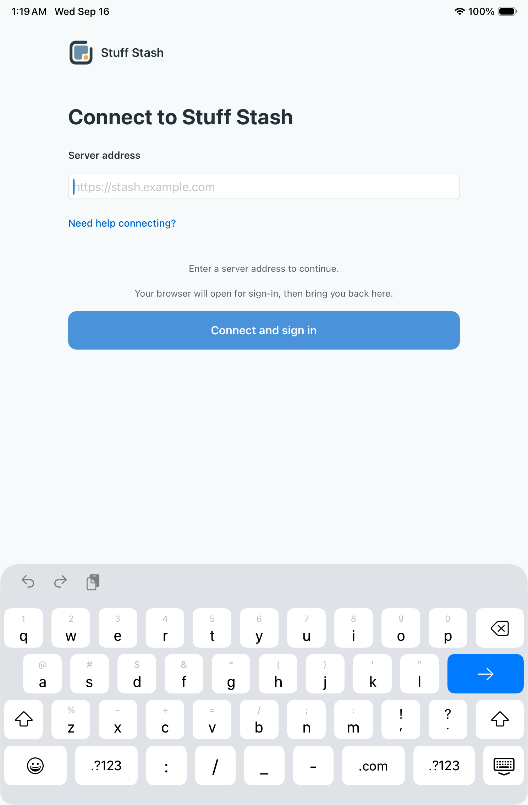

# iPad onboarding readiness — run35042066124

Job104625118124 completed2/3 cases passing. Source d39e423321528376c41f3f78b4629e680cc0c66e,
tested PR merge627e5dae2647cadf19ad7012a010560915f082a8. The phone onboarding job
passed; fixture jobs were still running when this report was written.

The failing connection-help case stopped before typing, at the keyboard readiness
predicate. It does not show text loss. The final screenshot shows the URL field
focused and a visible English keyboard. Its hierarchy exposes a Keyboard and
nonzero `q` key, as well as zero-size Padding-Left/Right key nodes.

The log reaches keyboard existence at t72.58, begins enumerating all key elements
at t85.43 and reports readiness timeout around t91. This indicates slow observation;
the screenshot and hierarchy do not prove key hittability during the predicate.
Do not call it a product regression or a false failure without a successful rerun.

The candidate queries the observed English URL-keyboard `q` key directly rather
than enumerating every key and probing padding nodes. It retains keyboard existence,
key hittability and the five-second expectation. It does not change app behavior,
typing cadence or full-string assertions. Other keyboard layouts are not covered
by this English-fixture target. Remote structural checks pass; native compilation
and acceptance remain pending.

Artifact10425894017, exported final-state image7BD77E2B-4545-4088-9B2A-D3E055E9CEF1.png
and hierarchyFE0DCEBE-9630-429C-8697-823BE8D1C954.txt were inspected. Raw log is
`/tmp/native350420-onboarding-ipad.log`; downloaded archive is
`/tmp/native350420-onboarding-ipad.zip`. The inside-form-column keyboard dismissal
and landscape adaptation cases passed in this job.
