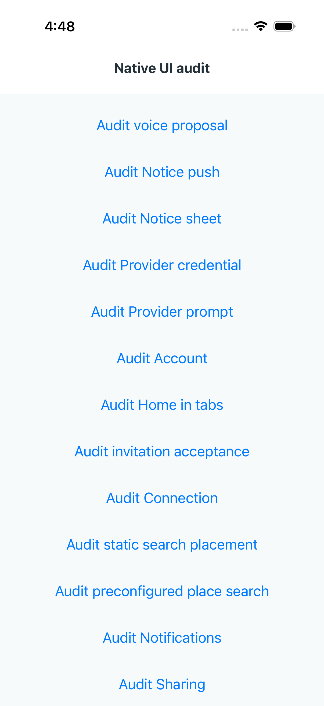
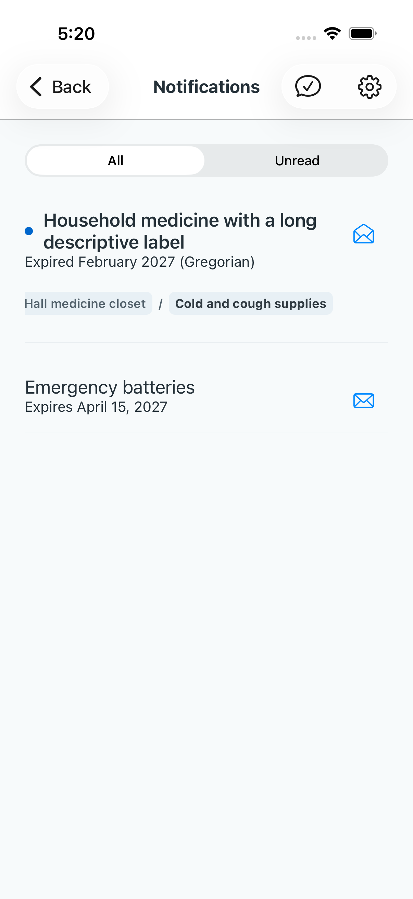

# Phone native audit — run35121454700

Source1a15ca11, tested mergec5b6f1b110135c3d80f1433429c84dcd248d8fdb;
iPhone17 job104881256251 completes67/85 tests,18 failures in3217.670 seconds.
Artifact10460153475,1,626,265,069 bytes, is retained on paul as
`/tmp/native351214-phone.zip`; selected captures are in
`/tmp/phone351214-selected`. The complete job log is local at
`/tmp/native351214-phone-complete.log`. Phone onboarding passed separately.
The iPad fixture job was still active at this inspection; do not restart it.

## Normal-size results

- Sharing recovery now passes, including the direct cancellation command and
  expected cancellation failure/recovery. Inspected cancellation capture
  `19E40272-1D65-4CBC-86C2-EC2B63C812CC.png` retains the invitation and retry action.
- Settings collection search and Add pass in this run. Preconfigured Place search
  still fails. This variability does not establish a shared search root cause;
  the managed-search/header-action comparison is newer than this source.
- Add unfinished-tag retention passes here, before the later exact-value wait.
  Keep its stronger observation candidate; do not attribute this pass to that change.
- Add photos complete preview, paging and draft removals, then fail the return
  test's scroll direction. Final capture shows the audit index; hierarchy places
  Audit Browse filters at y1116.3 below the visible116–874 scroll frame. The loop
  swiped downward12 times. Candidate chooses direction geometrically, preserving
  destination/hittability/foreground assertions. Native rerun remains required.
- Inbox stops before interaction because the envelope's accessible glyph width is24,
  below the test's44 requirement. Source declares a48-point host/frame. Neither
  fact proves delivered touch size. Candidate keeps the workflow and adds actual
  center/edge/corner toggles across a44-point region. No inbox native pass claimed.
- Ordinary color opening still fails; the separate target/region probes pass.
  M51 remains open. Controlled address/name diagnostics continue to corrupt text;
  these have not been fixed or reclassified as early reads.
- Voice proposal location/retry/return and native header retention tests pass.

## Deferred enlarged-text and diagnostic cases

Seven explicit enlarged-text workflows fail: asset-region, command height,
Details commands, Edit metadata, Edit tags, footer appearance and Move Here.
Expiration accessibility audit reports Text clipped. Inspected retained attachment
`E77CA478-877D-4589-A6F3-568120663EB6.txt` explicitly says, “Text of this element
may be clipped at larger Dynamic Type sizes.” This belongs to the deferred
enlarged-text investigation; it does not establish a normal-size clipping defect.
The attachment does not identify the element, so its cause remains unlocalized. Footer-full-sheet and
nested-full-sheet comparisons fail, while scroll-footer-full-sheet passes; the
failing comparison configurations are not the shipped route configurations.

The run remains a failed release gate. These results do not verify later Android
patches or claim whole-app native acceptance.

The test-only candidates pass six fixture-isolation checks and the mobile structural
check on paul. Critic requested enabled-state waiting before each delivered-target
probe and precise wording about state transitions rather than request counts; both
are incorporated. Swift compilation and runtime acceptance await the next native run.

## Retained text-entry comparison

Final hierarchies from the same artifact confirm that the field and React-observed
value agree on damaged text; these are not merely intermediate read assertions.

| Diagnostic | Final value | Retained hierarchy |
| --- | --- | --- |
| Controlled address | `h/example.invalid` | `AA7695E3-E282-4213-962C-BFFA182BC0A9.txt` |
| Controlled ordinary name | `Nve draft name` | `495A9882-148A-4FBB-9901-B8329AE7F119.txt` |
| Controlled name without accessory | `Nraft name` | `68A323EF-530B-4F2C-8F35-0444F8D594EF.txt` |
| Native-seeded RN name without accessory | `Nive draft name` | `0436C75D-9C6C-4DCF-A022-0D32BDA607E0.txt` |

The expected strings are `https://example.invalid` and `Native draft name`.
The job log records passes for both paced name variants, both no-assistance name
variants, the default-assisted SwiftUI field, the native system address, and the
uncontrolled RN address (with and without the accessory). These contrasts narrow
investigation but do not justify disabling assistance app-wide, blaming the
keyboard accessory, or declaring controlled state the sole cause. In particular,
the native-seeded RN name failure survives removing the accessory. Production
field families still need their own complete-entry, reset, retry and external-change
acceptance; passing a paced diagnostic must not replace those requirements.

## Artifact retention update — September 16

The full archive named above was removed from paul after confirming its GitHub
artifact remains available through September 30. Selected captures, hierarchies,
and recorded findings remain retained. This cleanup recovered space without
removing current-run evidence or touching active native jobs.
