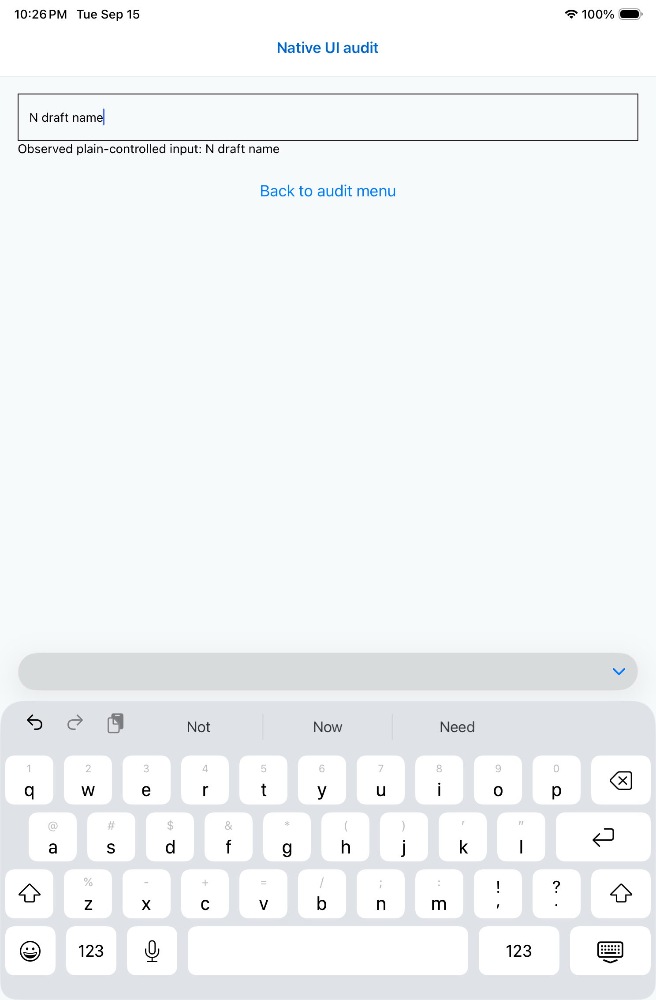

# Ordinary text-entry comparison

Run [35029455242](https://github.com/elsell/stuffstash/actions/runs/35029455242),
manual `text-entry`, revision0f37869173998e361b2c2435cd47c66d0ac019b4.

The iPad mini (A17 Pro) job104584271587 completed with4/5 tests passing. The
controlled ordinary field lost characters: expected `Native draft name`, actual
`N draft name`. The inspected capture shows both the visible field and observed
draft label holding that truncated string; this is not merely a missing locator.

Uncontrolled ordinary, multiline, uncontrolled without accessory, and uncontrolled
without assistance all passed in this run. Earlier runs failed the uncontrolled
ordinary baseline, so one passing sample does not close it. These comparisons
also do not establish whether assistance or the accessory affects controlled input.
The next fixed diagnostic adds controlled-without-assistance and
controlled-without-accessory while preserving every existing case and exact
assertion. No production keyboard behavior is being changed as a workaround.

Phone job104584271921 completed with3/5 passing. Controlled ordinary entry failed
before typing because XCTest could not establish an interactive keyboard; that is
not a controlled-field character-loss observation. Uncontrolled ordinary entry
did lose characters: expected `Native draft name`, actual `Ndraft name` at
FixtureAuditTests.swift:1082. Multiline, uncontrolled-without-accessory and
uncontrolled-without-assistance passed. These are terminal XCTest log results;
phone screenshots have not yet been inspected. The failures occurred at22:43–22:45
UTC on September15. This supports keeping both ordinary baselines open, rather
than attributing all loss to controlled React state.

Expanded manual run35031744887 at81e91f74 is now running. It includes both new
controlled comparisons; no outcome is inferred from its start.

The expanded diagnostic passes remote TypeScript, structural and fixture-preparation
checks. Critic found no confirmed issue. Disabling assistance is a bundle comparison
(autocorrection, spelling and smart insertion), not isolation of each setting.
