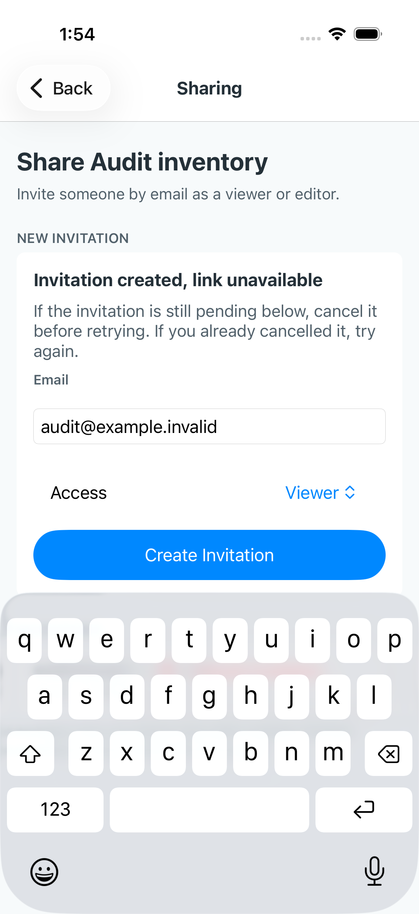

# Normal-text core workflow evidence — October 2, 2026

[Native run36941858463](https://github.com/elsell/stuffstash/actions/runs/36941858463)
passed both selected workflows on iPhone17 and iPad mini (A17 Pro), source
`47b43d396ea5b7c017136dcf761945fffcee5251`, English, normal text. The fixtures use
production tab layouts and voice accessory with controlled application ports.

Inspected full-screen Details captures show final metadata above the voice
accessory, with bottom tabs on iPhone and top tabs on iPad. The scroll assertions
also passed. This closes this specific current-main footer-clearance check.

- [iPhone Details](iphone-detail-footer-above-native-tabs.png)
- [iPad Details](ipad-detail-footer-above-native-tabs.png)

Sharing's final invitation and footer are visible above the voice accessory
in both captures, with bottom tabs on iPhone and top tabs on iPad. The automated
clearance checks also passed. Repeated large destructive cancellation buttons are a design
recommendation awaiting user confirmation, not an authorized new defect.

- [iPhone Sharing](iphone-sharing-footer-above-native-tabs.png)
- [iPad Sharing](ipad-sharing-footer-above-native-tabs.png)

A separate local source-behavior check at `cf9c6ac9` passed110 tests across
SearchScreen, useBrowseFilterNavigation, AssetNativeActionSheetScreens,
MoveDestinationCreation and AssetDetailRouteScreen. Browser action-deep-link
coverage passed four applicable scenarios; four device-inapplicable scenarios
were skipped. These use controlled ports/API fixtures. They establish selected
query retention, draft recovery, selection and route behaviors, not native visual
quality or production authentication.

This evidence does not complete the full Browse → Details → Edit/Move → return
journey against a real backend. Connected native sign-in, physical export saving,
assistive use and production performance remain unverified. The roadmap owns the
current queue; these passing checks are not a new product release.

## October 2 Sharing menu regression — release held

PR #238, native run [36951622669](https://github.com/elsell/stuffstash/actions/runs/36951622669), revision `ef5ba7a0`: both devices failed the keyboard-absence assertion when opening invitation actions. The iPhone capture confirms the keyboard obscures the invitation menu. Behavior tests pass but do not establish native acceptance. Ending the field session after failure did not fix this and was reverted; explicit SwiftUI blur also failed native acceptance. No further unchanged run is authorized by this evidence. Keep the PR unmerged until the focus/presentation interaction is resolved.

