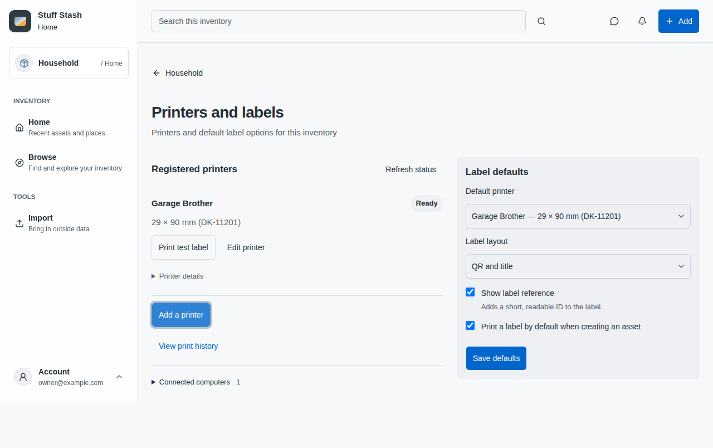
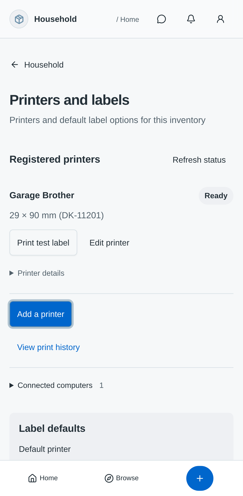
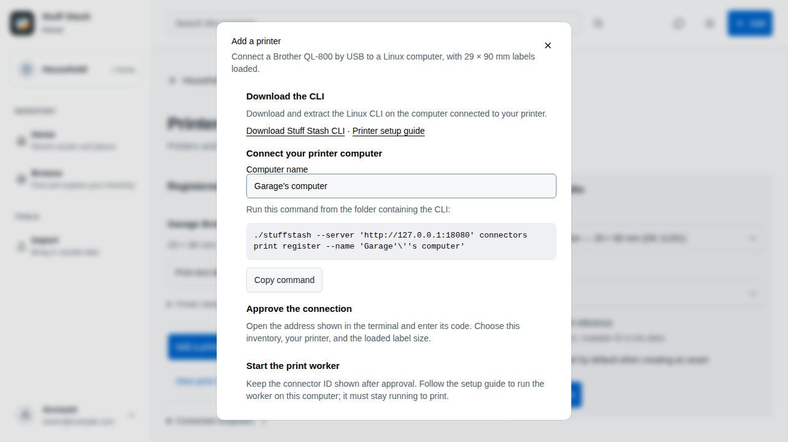
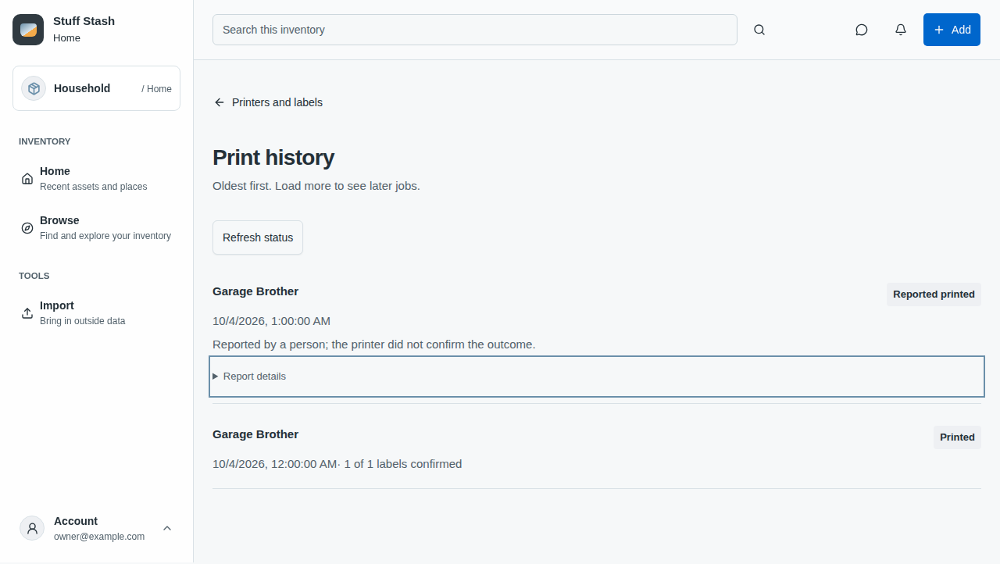

# Web printing settings audit

Reviewed October 4, 2026 against main `6d09cbce8`, the three supplied website
photos, and the resulting browser implementation. Scope: website printing settings
and its shared printer, test-label, asset-print and job-recovery components.

## Findings and changes

| Finding | User cost | Correction |
| --- | --- | --- |
| Defaults precede printer status; every control spans the page | Users must read setup fields to find whether printing works | Printer status/actions first, bounded defaults beside it on desktop and below on narrow screens |
| Report timestamps, CLI instructions and computers compete with daily tasks | Technical content obscures the action | Diagnostic disclosures; explicit Add printer setup with CLI download and guide links; offline and authorization problems remain visible |
| Raw identity strings dominate resolved jobs | Overflow and misleading emphasis on implementation details | Reported outcome leads; report details retain actor, time and device confirmation separately |
| Printer edits disappear on dismissal | Accidental Escape or outside click loses work | Keep editing / Discard changes; only a pending save locks dismissal; catalog reads remain cancelable; restore focus after both dialogs settle |
| Saved-defaults notice survives checkbox changes | Unsaved work looks saved | Notice reflects the saved draft, including checkbox changes |
| Registered media omits its friendly name | 29 × 89.8 mm looks different from the purchased 29 × 90 mm roll | Match catalog display name by adapter, preset and version; never change physical geometry |

The hierarchy and disclosure findings are observed in the supplied photos and
confirmed in source. Draft dismissal and nested focus handling were reproduced
and corrected in Chromium. This is not a certification of the whole website.

## Interaction decisions

Settings answers “is my printer ready?” and “what should labels use by default?”
History is a separate operational destination with its own route and normal Back
navigation. Known active and uncertain jobs stay beside printers so actionable
problems remain visible, including jobs for printers no longer in the list.
The same scoped controller preserves unsaved defaults when visiting history.

Add printer is a command opening a short setup dialog, not expandable help.
It shows the CLI download, a selectable and copyable registration command using
the configured API address, browser approval guidance, and the setup guide.
Computer names and API addresses are shell quoted. Failed clipboard access leaves
the command available for manual copying. Registration still chooses the inventory
through the existing browser approval flow; this UI never registers or prints
silently. Supplementary diagnostic details alone use disclosures.

The defaults are a single explicit-save draft: native checkboxes and the existing
accessible short-choice select remain appropriate. Printer editing is a bounded
modal task. Existing revision conflicts require explicit reload. Polling does not
replace defaults or open edits. Test printing remains an explicit command; opening
a dialog never prints. Shared job rows continue to distinguish device confirmation
from a human report and leave uncertain recovery visible.

These choices apply [Krug's usability approach](https://sensible.com/dont-make-me-think/)
as a review lens, not a claimed endorsement. Apple's current
[layout guidance](https://developer.apple.com/design/human-interface-guidelines/layout)
was read through its official DocC data on October 4: order by importance, group
related content, and disclose supplementary information. Apple-specific native
materials and controls are not imposed on the browser. Disclosure keyboard behavior
follows the [WAI pattern](https://www.w3.org/WAI/ARIA/apg/patterns/disclosure/)
through native HTML details/summary, with existing Bits/shadcn dialogs for modality.

## Coverage and evidence

- Production workspace route, shell and adapter: desktop and mobile Chromium
  acceptance covers catalog display names, report disclosure, long-ID reflow,
  Escape → Keep editing, persisted save, explicit discard and trigger focus.
  The revised route checks also cover history navigation with draft preservation,
  empty-printer setup, configured API commands, and visible download/setup links.
  Browser permission denial verifies the manual-copy fallback; a controlled clipboard
  fake verifies successful copying and a name change during a pending write.
- Real production components with a stateful repository: 390px and 1280px fixtures
  cover ready, empty/setup, loading, unavailable/retry, viewer, offline/paper error,
  uncertain recovery, test dialog, and report detail expansion. No hardware output.
- Existing critical component tests cover revision conflicts, permission changes,
  ambiguous print requests, linked reprints, polling and manual resolution.
- Shared consumers inspected: InventoryPrintingSettings, PrinterTestDialog and
  AssetPrintDialog all use PrintJobList; no domain, API or permission changes.
- Asset menu/scanner/pairing/rotation entry points inspected for unchanged
  composition; native clients, camera scanning, screen-reader speech and physical
  printer behavior are outside this web refactor's runtime evidence.

Screenshots from the workspace acceptance accompany the pull request. Supplied
before photos remain in the review conversation. Generated fixture routes and
local dependency-serving configuration are not shipped.

Validation: 1,235 web tests across 187 files; both Chromium workspace projects;
web production build and type checking; shadcn, visual-token and localization
checks; docs production build and rendered-table check. The pre-commit runner was
not installed in this worktree; its applicable commands were run directly.
Type checking retains one unrelated, existing unused `h4` selector warning.
The final code-critic review reported no confirmed blockers.

Follow-up: the API currently paginates jobs by ascending ID
(`printing_jobs_repository.go:33`), so old jobs can precede newer outcomes beyond
the first page. The web heading now says Print history. This patch does not
reverse a partial page or pretend it fetched the newest jobs; a latest-first
API cursor contract remains separate work for larger histories.

Follow-up validation reproduced the pending-read dismissal trap before correction.
Four focused printer tests then passed, including canceling a pending read with
late-result suppression and keeping a pending write locked. Both workspace browser
projects also passed Escape during loading with trigger-focus restoration. Type
checking, production build and the follow-up code-critic review passed.

The final task-separation revision passed 44 focused tests and four workspace
Chromium cases (desktop and narrow screens), plus type checking, production build,
visual/component boundaries and localization checks. The critic found a pending
clipboard acknowledgment race; it was corrected and verified with a deferred fake.
